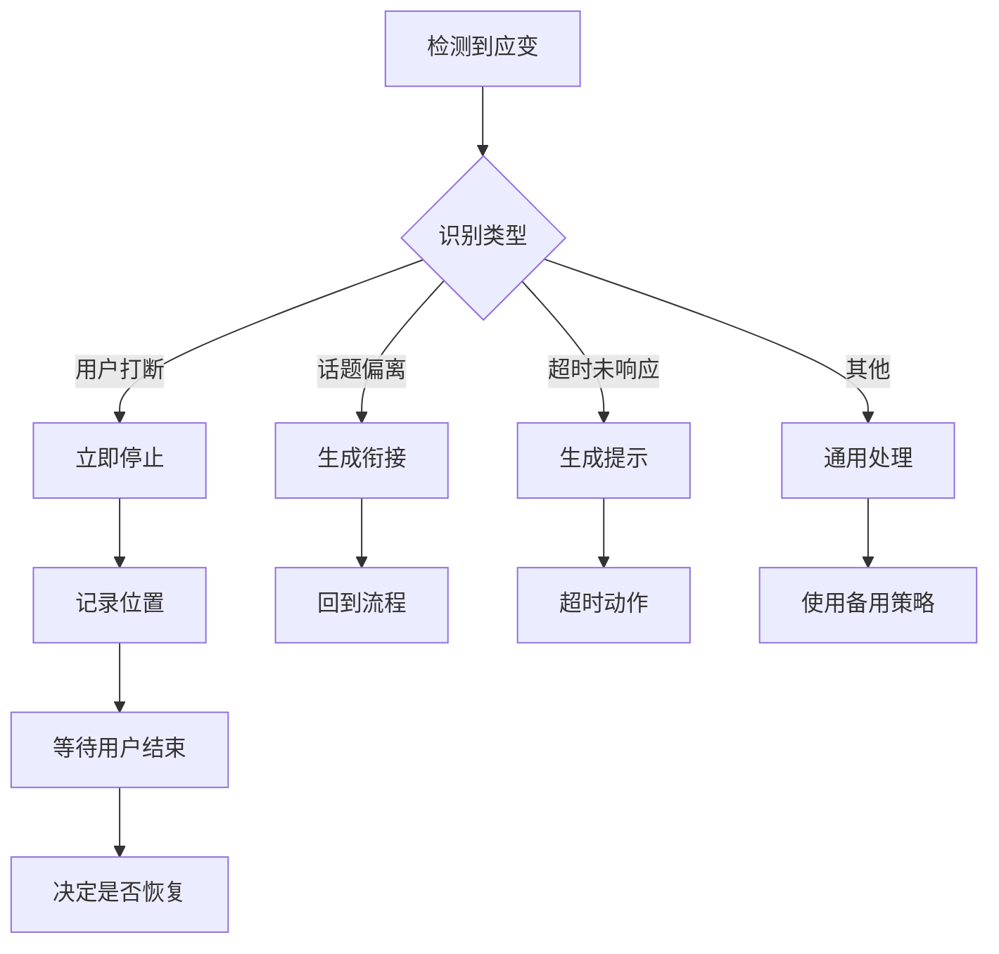

# 临场应变策略

## 概述

本文档定义AIMC数字人主持系统在处理用户临场变化时的策略和方法。

## 应变场景分类

### 按严重程度分类

#### 1. 轻微变化（P2级别）
- **定义**：用户发言与预期基本一致，但有少量补充或调整
- **处理策略**：使用正常衔接词，继续按流程进行

#### 2. 中等变化（P1级别）
- **定义**：用户发言偏离预期较多，但主题相关
- **处理策略**：生成衔接词，回到流程

#### 3. 重大变化（P0级别）
- **定义**：用户发言完全偏离主题或有意外情况
- **处理策略**：暂停当前流程，处理意外情况

---

## 具体场景处理策略

### 场景 1: 用户打断AI发言

**场景描述**：AI正在发言，用户突然开始说话

**处理策略**：
1. **立即停止**：立即停止当前AI发言
2. **记录位置**：记录当前发言位置，以便后续恢复
3. **生成打断衔接词**：
   - 可选衔接词：
     - "好的，请您继续！"
     - "打断一下，我先补充..."
     - "不好意思，我想说说我的看法..."
4. **等待用户说完**：使用HumanDetector检测用户结束
5. **恢复流程**：根据用户发言内容，决定是否继续原流程

**配置参考**：
- 允许打断：true
- 恢复超时：30秒

---

### 场景 2: 用户话题偏离

**场景描述**：用户发言偏离了当前环节的主题

**处理策略**：
1. **识别偏离**：ContextAnalyzer检测到话题偏离
2. **生成衔接词**：
   - 可选衔接词：
     - "好的，这个话题很有意思！不过按照今天的议程，我们先..."
     - "是的，这个观点很重要，不过我们回到..."
     - "这个确实值得探讨，不过我们先处理..."
3. **回到流程**：继续执行原流程

**配置参考**：
- 偏离相似度阈值：< 0.6
- 最大偏离容忍时长：60秒

---

### 场景 3: 用户超时未响应

**场景描述**：AI说完后，用户在预期时间内未开始说话

**处理策略**：
1. **延长等待**：延长静默判断时长（从2秒→3秒）
2. **生成提示语**：
   - 可选提示语：
     - "好的，我们继续..."
     - "您还有什么补充吗？没有的话我们..."
     - "好的，感谢您！现在我们..."
3. **超时动作**：
   - 选项：继续流程 / 暂停 / 使用备用内容

**配置参考**：
- 等待超时阈值：30秒
- 备用内容：预生成的通用衔接词

---

### 场景 4: 用户即兴发挥

**场景描述**：用户没有按预期发言，而是即兴发挥

**处理策略**：
1. **识别即兴**：检测到用户发言与预期相似度较低但主题相关
2. **生成呼应内容**：
   - 可选回应：
     - "您说得很好！"
     - "这个观点很有见地！"
     - "我完全同意您的看法！"
3. **引导回流程**：
   - 可选衔接：
     - "让我们回到..."
     - "好的，关于..."
     - "我们继续..."

**配置参考**：
- 即兴相似度阈值：0.4 - 0.6
- 最大即兴时长：30秒

---

### 场景 5: 观众互动

**场景描述**：用户与现场观众互动，导致流程暂停

**处理策略**：
1. **识别互动**：检测到用户提到"观众"、"大家"等词
2. **生成互动回应**：
   - 可选回应：
     - "让我们听听这位观众的看法！"
     - "感谢您的提问！"
     - "这位观众说得很好！"
3. **临时调整流程**：
   - 允许互动超时：120秒
   - 互动后引导：使用通用衔接词回到流程

**配置参考**：
- 互动关键词：["观众", "大家", "提问", "发言"]
- 互动超时阈值：120秒

---

### 场景 6: 用户重复

**场景描述**：用户重复了之前说过的内容

**处理策略**：
1. **识别重复**：检测到文本相似度 > 0.8
2. **生成回应**：
   - 可选回应：
     - "您刚才提到的这点很重要！"
     - "是的，这点确实值得强调！"
     - "您说得对！"
3. **继续流程**：避免重复，快速过渡

**配置参考**：
- 重复相似度阈值：> 0.8
- 最小重复内容长度：100字符

---

## 应变响应生成策略

### 1. 预制库优先策略

```python
class ResponseStrategy:
    def get_response(self, change_type, context):
        # 1. 首先尝试从预制库获取
        response = self._get_from_prefab(change_type, context)

        if response:
            return response

        # 2. 预制库未找到，实时生成
        return self._generate_real_time(change_type, context)

    def _get_from_prefab(self, change_type, context):
        # 从materials/衔接词库/读取
        with open(f"materials/衔接词库/{change_type}.txt", "r") as f:
            responses = [line.strip() for line in f if line.strip()]

        if responses:
            return random.choice(responses)

        return None
```

### 2. 优先级策略

```python
class ResponsePrioritizer:
    PRIORITY = [
        "prefab_based_on_context",    # 基于上下文的预制响应
        "prefab_generic",            # 通用预制响应
        "generated_specific",        # 特定场景的生成响应
        "generated_generic"          # 通用生成响应
    ]
```

### 3. 个性化策略

根据用户的特征调整响应：

```python
class PersonalizedResponse:
    def adjust(self, response, user_profile):
        if user_profile.get("title") == "专家":
            response = response.replace("您说得很好", "您的观点非常专业")
        elif user_profile.get("is_young"):
            response = response.replace("非常重要", "超棒的想法")

        return response
```

---

## 应变质量评估

### 评估指标

#### 1. 响应相关性 (Relevance)
- **定义**：响应内容与当前上下文的相关程度
- **评估方法**：文本相似度分析
- **目标值**：≥ 0.7

#### 2. 响应自然度 (Naturalness)
- **定义**：响应是否自然流畅，符合人类对话习惯
- **评估方法**：
  - 检查是否有重复表达
  - 检查是否有生硬的过渡
  - 检查响应长度是否合适
- **目标值**：≥ 0.8

#### 3. 响应速度 (Response Time)
- **定义**：从检测到变化到生成响应的时间
- **目标值**：< 1秒（理想），< 2秒（可接受）

#### 4. 用户满意度 (Satisfaction)
- **定义**：用户对响应的满意程度
- **评估方法**：
  - 后评估：查看后续对话是否顺畅
  - 用户反馈：通过反馈渠道收集

---

## 配置和优化

### 可配置参数

```yaml
应变策略配置:
  检测灵敏度:
    语音检测阈值: 500
    静默判断时长: 2.0
    超时阈值: 1.3

  响应策略:
    预制库优先: true
    实时生成备用: true
    响应长度范围: [10, 30]

  场景处理:
    允许打断: true
    打断后恢复: true
    话题偏离容忍: true
    即兴发挥容忍: true

  超时处理:
    等待超时: 30
    恢复超时: 60
    备用策略: "continue"
```

### 优化建议

1. **收集反馈**：记录所有应变场景，定期分析响应效果
2. **更新预制库**：根据反馈，优化和更新衔接词库
3. **调整参数**：
   - 如果误判较多，调整检测阈值
   - 如果响应不够自然，优化响应生成策略
4. **A/B测试**：使用不同策略进行对比测试

---

## 边界情况处理

### 处理流程图



### 回滚策略

如果应变处理失败：
1. **降级处理**：使用预定义的简单策略
2. **恢复流程**：跳过当前环节，继续执行
3. **人工干预**：如果无法自动处理，通知用户

---

## 最佳实践

### 设计原则

1. **快速响应**：响应时间是用户体验的关键
2. **自然衔接**：响应内容要符合对话场景
3. **可恢复性**：应变后要能够恢复流程
4. **最小化影响**：应变处理要尽量减少对整体流程的影响

### 开发建议

1. **模块化**：将每种场景的处理逻辑模块化
2. **可配置**：重要参数可配置，方便测试和优化
3. **可扩展**：支持添加新的应变场景
4. **充分测试**：覆盖各种边界情况

---

## 更新日志

| 版本 | 日期 | 说明 |
|------|------|------|
| 1.0 | 2026-03-13 | 初始版本，包含基本场景策略 |
