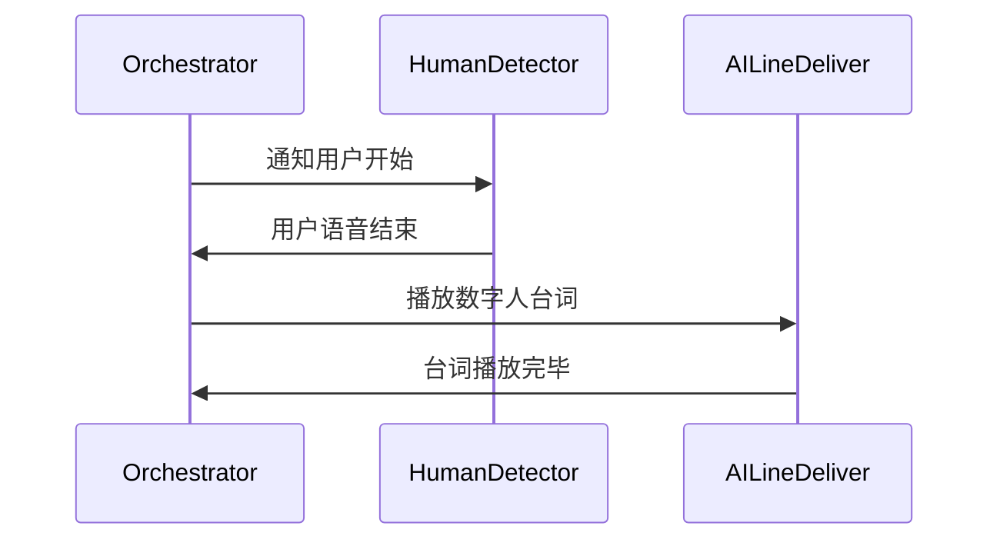

# AIMC 数字人主持系统 - 调研报告

## 项目概述

### 项目背景
为提升大型会议的主持体验，设计并开发一套AI数字人主持系统，实现与人类主持人的协同主持功能。系统将具备智能语音识别、上下文理解、临场应变和演讲评价等核心能力。

### 项目目标
开发一个功能完整、架构清晰的数字人主持系统，支持：
1. 基础主持流程控制
2. 智能语音交互
3. 临场应变能力
4. 演讲评价功能
5. 可扩展的技能集成

---

## 问题分析

### 核心挑战

#### 1. 实时语音交互挑战
- **问题**：如何准确判断人类主持人何时结束发言，确保无缝切换
- **影响**：直接影响用户体验的流畅性

#### 2. 上下文理解挑战
- **问题**：如何理解人类主持人的即兴发言，并生成合适的衔接内容
- **影响**：决定数字人是否能自然融入主持场景

#### 3. 演讲评价挑战
- **问题**：如何实时记录演讲要点并生成专业评价
- **影响**：评价质量直接影响会议的专业性

#### 4. 系统稳定性挑战
- **问题**：如何确保在长时间运行中的系统稳定性
- **影响**：关系到会议的顺利进行

---

## 技术架构设计

### 基于POMASA的架构模式

#### 架构层次
```
AIMC/
├── agents/                          # Agent蓝图文件
├── methodology/                     # 方法论指导
├── materials/                       # 原始材料
├── drafts/                          # 临时状态
└── final/                          # 最终产出
```

#### 核心代理架构

##### 1. Orchestrator (主持流程协调器)
```markdown
# Orchestrator - 主持流程协调器

## 角色定位
负责整个主持流程的协调和控制，管理用户与数字人的对话交替。

## 行为规范

### 主要职责
1. 严格按照 `materials/主持流程配置.yaml` 执行主持流程
2. 调用 HumanDetector 检测用户语音结束时机
3. 调用 AILineDeliver 播放数字人台词
4. 调用 ContextAnalyzer 分析对话上下文
5. 调用 ResponseGenerator 处理临场应变
6. 调用 SpeechEvaluator 生成演讲评价

### 流程控制逻辑

#### 正常流程


#### 异常处理
- 用户打断：立即停止当前播放，记录上下文，调用 ResponseGenerator
- 用户跳过：跳过当前环节，调用 ResponseGenerator 生成衔接词
- 超时：用户超时未响应，调用 ResponseGenerator 生成提示语
```

##### 2. HumanDetector (用户语音检测)
```markdown
# HumanDetector - 用户语音检测

## 角色定位
负责检测用户的语音活动，判断何时停止说话，为数字人提供准确的启动时机。

## 行为规范

### 检测原理
使用音量检测与静默检测的混合方案：

```python
import audioop
import pyaudio

class HumanSpeechDetector:
    def __init__(self, threshold=500, silence_duration=2.0):
        self.threshold = threshold
        self.silence_duration = silence_duration
        self.last_speech_time = 0

    def detect_speech(self, audio_data):
        rms = audioop.rms(audio_data, 2)

        current_time = time.time()

        if rms > self.threshold:
            self.last_speech_time = current_time
            return True
        else:
            if current_time - self.last_speech_time > self.silence_duration:
                return False
            else:
                return True
```

### 配置参数
- `threshold`: 语音检测阈值，默认 500
- `silence_duration`: 静默判断时长，默认 2.0 秒
```

##### 3. AILineDeliver (数字人台词交付)
```markdown
# AILineDeliver - 数字人台词交付

## 角色定位
负责管理数字人的台词播放，支持TTS实时合成和预生成音频。

## 行为规范

### 音频管理策略
```python
class AILineDeliver:
    def __init__(self, tts_api, audio_cache_dir):
        self.tts_api = tts_api
        self.audio_cache = {}
        self.cache_dir = audio_cache_dir

    def play_line(self, text, use_cache=True):
        if use_cache and text in self.audio_cache:
            self._play_audio_file(self.audio_cache[text])
        else:
            audio_file = self.tts_api.synthesize(text)
            if use_cache:
                self.audio_cache[text] = audio_file
                self._save_to_cache(text, audio_file)
            self._play_audio_file(audio_file)
```

### 配置参数
- `tts_provider`: TTS服务提供商，支持多种API
- `audio_format`: 音频格式，默认 MP3
- `cache_enabled`: 是否启用音频缓存，默认 True
```

##### 4. ContextAnalyzer (上下文分析)
```markdown
# ContextAnalyzer - 上下文分析器

## 角色定位
负责分析用户的实际发言内容，检测与预设台词的偏离，识别临场变化。

## 行为规范

### 分析策略
```python
class ContextAnalyzer:
    def analyze(self, user_speech, expected_text, context_history):
        similarity = self._calculate_similarity(user_speech, expected_text)

        analysis = {
            "similarity": similarity,
            "isDeviated": similarity < 0.6,
            "keyPoints": self._extract_key_points(user_speech),
            "duration": len(user_speech.split()) / 120.0  # 估算时长
        }

        return analysis
```

### 分析维度
- 文本相似度分析
- 关键点提取
- 发言时长分析
- 偏离程度判断
```

##### 5. ResponseGenerator (应变响应)
```markdown
# ResponseGenerator - 应变响应生成

## 角色定位
负责生成数字人的响应内容，包括衔接词、应变内容和评价。

## 行为规范

### 响应策略
```python
class ResponseGenerator:
    def generate_response(self, context, situation):
        if situation == "normal":
            return self._get_normal_response(context)
        elif situation == "interrupt":
            return self._get_interrupt_response(context)
        elif situation == "skip":
            return self._get_skip_response(context)
        elif situation == "evaluate":
            return self._get_evaluation_response(context)
```

### 响应类型
- 正常流程响应
- 中断应变响应
- 跳过环节响应
- 演讲评价响应
```

##### 6. SpeechEvaluator (演讲评价)
```markdown
# SpeechEvaluator - 演讲评价

## 角色定位
负责在演讲过程中实时记录要点，并生成专业的评价内容。

## 行为规范

### 评价生成策略
```python
class SpeechEvaluator:
    def record_speech(self, speaker, content, timestamp):
        self._add_to_transcript(speaker, content, timestamp)
        self._extract_evaluation_points(content)

    def generate_evaluation(self, speaker):
        intro = self._get_evaluation_intro(speaker)
        body = self._generate_evaluation_body()
        conclusion = self._get_evaluation_conclusion()

        return f"{intro}\n{body}\n{conclusion}"
```

### 评价维度
- 内容质量
- 表达能力
- 时间控制
- 观众反应
```

---

## 技术实现方案

### 核心技术选型

#### 1. 语音识别技术
- **方案**：使用 Google Speech-to-Text API
- **理由**：准确率高，支持多种语言
- **成本**：按使用量计费

#### 2. 语音合成技术
- **方案**：使用 AWS Polly 或 Azure Text-to-Speech
- **理由**：语音质量高，支持多种音色
- **成本**：按字符数计费

#### 3. 自然语言处理
- **方案**：使用 spaCy + scikit-learn
- **理由**：开源工具，灵活可定制
- **成本**：免费

#### 4. 对话管理
- **方案**：使用 Rasa 或 Dialogflow
- **理由**：成熟的对话管理框架
- **成本**：基础版本免费

---

## 成本估算

### 开发阶段成本

#### 1. 人力成本

| 角色 | 人数 | 工作时间 | 平均工资 | 总成本 |
|------|------|----------|----------|--------|
| 架构师 | 1 | 4周 | 3000元/周 | 12,000元 |
| 开发工程师 | 3 | 8周 | 2000元/周 | 48,000元 |
| UI/UX设计师 | 1 | 2周 | 1500元/周 | 3,000元 |
| 测试工程师 | 1 | 2周 | 1500元/周 | 3,000元 |
| **合计** | **6人** | **16周** | **-** | **66,000元** |

#### 2. 硬件成本

| 设备类型 | 数量 | 单价 | 总成本 | 说明 |
|---------|------|------|--------|------|
| 开发服务器 | 1 | 10,000元 | 10,000元 | 用于系统开发和测试 |
| 语音采集设备 | 1 | 3,000元 | 3,000元 | 高质量麦克风 |
| **合计** | **-** | **-** | **13,000元** | **-** |

#### 3. 软件成本

| 软件/服务 | 类型 | 成本 | 说明 |
|---------|------|------|------|
| TTS API | 订阅 | 5,000元/年 | 按使用量计费 |
| Speech API | 订阅 | 5,000元/年 | 按使用量计费 |
| 其他工具 | 订阅 | 2,000元/年 | IDE、版本控制等 |
| **合计** | **-** | **12,000元/年** | **-** |

#### 开发阶段总成本：**66,000 + 13,000 + 12,000 = 91,000元**

---

### 运营阶段成本

#### 1. 云服务成本

| 服务类型 | 配置 | 成本 | 说明 |
|---------|------|------|------|
| 计算实例 | 2核4GB | 300元/月 | 基础计算资源 |
| 存储 | 100GB | 50元/月 | 数据存储 |
| CDN流量 | 100GB/月 | 200元/月 | 音频文件分发 |
| **合计** | **-** | **550元/月** | **-** |

#### 2. API使用成本

| API类型 | 预估使用量 | 成本 | 说明 |
|---------|----------|------|------|
| TTS | 100,000字符/月 | 300元/月 | 数字人台词合成 |
| Speech | 50,000分钟/月 | 400元/月 | 语音识别 |
| **合计** | **-** | **700元/月** | **-** |

#### 运营阶段总成本：**550 + 700 = 1,250元/月**

---

## 风险分析

### 技术风险

#### 1. 语音识别准确率风险
- **风险等级**：中等
- **影响**：可能导致切换时机判断错误
- **缓解策略**：使用多个API备份，优化识别参数

#### 2. TTS响应时间风险
- **风险等级**：低
- **影响**：可能导致数字人延迟响应
- **缓解策略**：预生成音频，优化API调用

#### 3. 系统稳定性风险
- **风险等级**：高
- **影响**：可能导致系统崩溃
- **缓解策略**：架构设计注重稳定性，进行充分测试

### 业务风险

#### 1. 用户接受度风险
- **风险等级**：中等
- **影响**：决定项目的商业前景
- **缓解策略**：进行充分的用户测试

#### 2. 技术过时风险
- **风险等级**：低
- **影响**：可能需要频繁更新技术方案
- **缓解策略**：采用模块化架构，易于升级

---

## 实施计划

### 开发阶段

#### 第一阶段：基础架构搭建 (2周)
- 创建项目结构
- 实现核心Agent框架
- 建立基础配置系统

#### 第二阶段：核心功能开发 (6周)
- 实现语音识别功能
- 实现语音合成功能
- 实现基础流程控制

#### 第三阶段：智能功能开发 (4周)
- 实现上下文分析
- 实现应变响应生成
- 实现演讲评价功能

#### 第四阶段：优化测试 (4周)
- 性能优化
- 稳定性测试
- 用户体验优化

#### 第五阶段：部署上线 (2周)
- 生产环境部署
- 系统监控配置
- 最终测试

---

## 质量保障

### 质量标准

#### 1. 功能完整性
- 所有核心功能必须实现
- 所有边界情况必须处理

#### 2. 性能标准
- 语音识别响应时间 < 0.5秒
- TTS响应时间 < 1秒
- 系统延迟 < 2秒

#### 3. 稳定性标准
- 7×24小时运行无故障
- 错误率 < 1%

#### 4. 用户体验标准
- 响应自然流畅
- 界面友好易用
- 帮助文档完整

---

## 可扩展性设计

### 技能集成架构

#### 1. 插件化设计
```python
class SkillManager:
    def load_skill(self, skill_name):
        # 动态加载技能
        pass

    def execute_skill(self, skill_name, context):
        # 执行技能
        pass
```

#### 2. 技能开发接口
```python
class BaseSkill:
    def process(self, context):
        raise NotImplementedError

    def get_name(self):
        raise NotImplementedError

    def get_version(self):
        raise NotImplementedError
```

### 支持的技能类型
- 对话技能
- 信息查询技能
- 任务执行技能
- 内容生成技能

---

## 结论

### 项目可行性

#### 技术可行性
- 现有技术已具备实现基础
- POMASA架构提供了清晰的设计方法
- 模块化设计降低了开发难度

#### 经济可行性
- 开发成本在可接受范围内
- 运营成本可控
- 有明确的商业价值

#### 市场可行性
- 会议主持场景需求明确
- 数字人技术应用前景广阔

### 建议

1. **技术路线**：采用模块化架构，分阶段开发
2. **风险控制**：重点关注系统稳定性和用户体验
3. **迭代策略**：持续收集用户反馈，快速迭代优化
4. **市场推广**：从垂直领域开始，逐步扩展应用场景

---

## 下一步行动

### 立即行动项
1. 创建详细的产品需求文档
2. 确定技术合作伙伴和供应商
3. 开始基础架构的开发工作

### 后续计划
1. 进行用户需求调研
2. 开发第一个可工作的原型
3. 进行用户测试和反馈收集
4. 优化和完善产品功能

---

## 联系方式

- **项目负责人**：[您的姓名]
- **联系邮箱**：[您的邮箱]
- **项目网站**：[项目链接]
